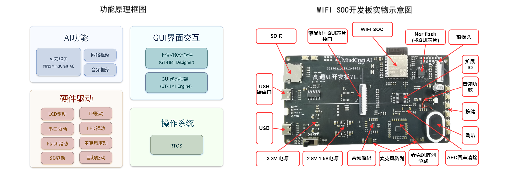

 

    

 

  <a><b>GT-MindCraft Embedded-开源硬件系列</b></a>

  <a><b>致力于低代码开发，强大的嵌入式GUI智能交互解决方案</b></a>

---

 

    <a href="https://www.hmi.gaotongfont.cn"
    > 公司官网 </a> |
    <a href="https://space.bilibili.com/3493293474188211/channel/collectiondetail?sid=3764678"
    > B 站教程 </a> |
    <a href="https://www.hmi.gaotongfont.cn/gthmiengineyhsc"
    > Engine 使用手册 </a> |
    <a href="https://www.hmi.gaotongfont.cn/gthmidesigneryhsc"
    > Designer 使用手册 </a> |
    <a href="http://isite.baidu.com/site/wjz7qkrv/406a2b0c-f9c7-4a08-a47a-662e862b2af4?ch=48&wid=498ccd5c05334f21a2142ba3cf628964_0_0&field=&orderBy=&categoryId=undefined&title=%E8%81%94%E7%B3%BB%E6%88%91%E4%BB%AC"
    > 联系方式 </a> |
    <a href="https://genitop-1317577547.cos.ap-nanjing.myqcloud.com/GT-HMI/GT-HMI-Groups/GT-HMI%20Communication%20groups.jpg"
    > GT HMI微信交流群 </a>

 

#### 介绍
<ul>
&nbsp;&nbsp;&nbsp;&nbsp;&nbsp;&nbsp;&nbsp;&nbsp;GT-MindCraft Embedded 开源硬件系列是一个集成了GT-HMI图形用户界面（GUI）框架和智匠MindCraft一站式AI调用平台的综合解决方案，使用WIFI SOC开源硬件，通过GT-HMI与智匠MindCraft的一站式AI调用平台的完美搭配，开发者不仅可以轻松实现聊天机器人应用，还可以探索更多创新应用场景，如智能家居、智能办公等。GT-MindCraft Embedded 开源硬件系列为开发者提供了强大的技术支持，助力实现更多可能性。
</ul>

#### 实物显示效果及GT-HMI工程界面

    

#### 功能与硬件框图

    

#### 项目架构
<ul>
<li>GT-MindCraft Embedded文件夹结构</li>
<table>
 <tr>
  <td>chatbot/</td>
  <td>chatbot开发板的软硬件资料</td>
 </tr>
 <tr>
  <td>  |-ESP32 IDF Project/</td>
  <td>chatbot开发板示例ESP32 IDF工程文件</td>
 </tr>
 <tr>
  <td>  |-hmi-project/</td>
  <td>chatbot开发板示例GT-HMI 工程文件</td>
 </tr>
 <tr>
  <td>    |- |-board/</td>
  <td>资源文件及代码</td>
 </tr>
 <tr>
  <td>    |- |-out/</td>
  <td>资源文件及代码（适合非HMI模块用户）</td>
 </tr>
 <tr>
  <td>    |- |-screen/</td>
  <td>UI界面交互代码</td>
 </tr>
 <tr>
  <td>    |- |-sources/</td>
  <td>图片素材文件</td>
 </tr>
 <tr>
  <td>    |- |-*.gtui尾缀文件</td>
  <td>模块的示例工程文件，使用HMI-Designer打开</td>
 </tr>
 <tr>
  <tr>
  <td>  |-Hardware/</td>
  <td>chatbot开发板原理图，PCB </td>
 </tr>
</table>
</ul>

#### 快速开始
<ul>
<li style="margin-bottom: 4px;">硬件准备：
<ul>
<li>客户可参考项目架构中子文件夹内的Hardware文件夹下的硬件资料自己设计PCB板。</li>
<li>也可以使用以子文件夹命名型号的模块或者开发板，如若使用模块或者开发板请拨打0755-83453881联系业务人员</li>
</ul>
</li>
<li style="margin-bottom: 4px;">软件安装：
<ul>
<li>从高通官网www.hmi.gaotongfont.cn下载并安装HMI-Designer软件。用于打开各个子文件夹中的以.gtui扩展名结尾的HMI工程文件。</li>
</ul>
</li>
<li style="margin-bottom: 4px;">移植：
<ul>
<li>如果是使用资料中提供的硬件资料用其他MCU自行设计PCB，需要适配硬件驱动，移植教程详见https://www.hmi.gaotongfont.cn/gthmiengineyzczlc</li>
</ul>
</li>
<li style="margin-bottom: 4px;">其他注意事项：
<ul>
<li>更详细的使用说明请参考各个子文件夹内的README.md文件</li>
</ul>
</li>
</ul>

**视频教程，陆续发布，敬请期待**

<ul>
<li style="margin-bottom: 4px;"><a href="https://www.bilibili.com/video/BV1qP22YSEQW/?spm_id_from=333.337.search-card.all.click&vd_source=0d93f7ed5a2d40d6e2d321f392d5e6f3">高通智匠AI开发板：整体框架的环境搭建</a></li>
<li style="margin-bottom: 4px;"><a href="https://www.bilibili.com/video/BV1TGmGYgEAS/?spm_id_from=333.999.0.0&vd_source=0d93f7ed5a2d40d6e2d321f392d5e6f3">高通智匠AI开发板：GUI界面的设计流程</a></li>
<li style="margin-bottom: 4px;"><a href="https://www.bilibili.com/video/BV15jyPY9EfS/?spm_id_from=333.999.0.0&vd_source=0d93f7ed5a2d40d6e2d321f392d5e6f3">高通智匠AI开发板：链接AI云服务</a></li>
<li style="margin-bottom: 4px;"><a href="https://www.bilibili.com/video/BV15JyBYSEpA/?spm_id_from=333.999.0.0&vd_source=0d93f7ed5a2d40d6e2d321f392d5e6f3">高通智匠AI开发板：GUI界面与业务逻辑交互</a></li>
</ul>

**智匠chatbot API接口文档**

<ul>
<li style="margin-bottom: 4px;"><a href="https://apifox.com/apidoc/shared-0fd7ea54-919e-4c93-b673-c60219bc82e0/api-213657897">chat bot 参数获取</a></li>
<li style="margin-bottom: 4px;"><a href="https://apifox.com/apidoc/shared-0fd7ea54-919e-4c93-b673-c60219bc82e0/api-213657897">chat_bot_v1 API接口及示例</a></li>
</ul>

 

**智匠AI KEY申请流程**

<ul>
<li style="margin-bottom: 4px;"><a href="https://apifox.com/apidoc/shared-0fd7ea54-919e-4c93-b673-c60219bc82e0/doc-4739665">如何获取API KEY</a></li>
</ul>
